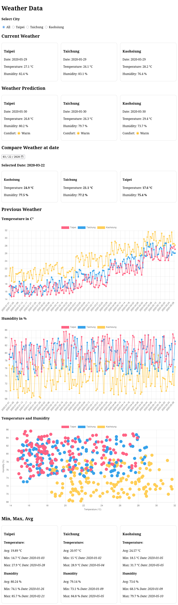

# Sensor Weather Dashboard
Simple weather dashboard using sensor data from a JSON file.



# Features
- View current weather per city
- View Weather Prediction
- Show min, max and average values
- Compare cities by selected date
- Temperature and humidity statistics
  
# Technologies
- JavaScript
- HTML
- CSS
 
# Start
Open the project in a local server and load:

``` bash
index.html
```

# Data
The data is gernerated in Colab and used as an JSON export

## Colab
The Colab Projekt can be found here: [Smart-City-Colab](https://colab.research.google.com/drive/1dLbjqbht3_L4Og_UpECO1DcWNCTqG8Z4?usp=sharing)

## Data Format

```JSON
{
  "timestamp": "2020-05-28",
  "location": "Taipei",
  "temperature": 27.9,
  "humidity": 84.0
}
```
